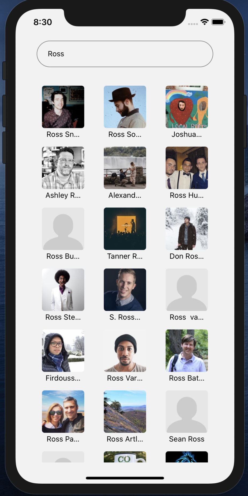
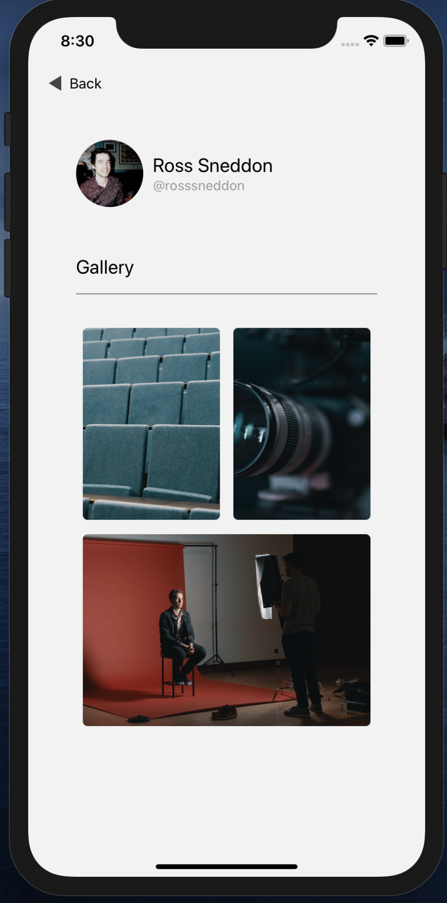
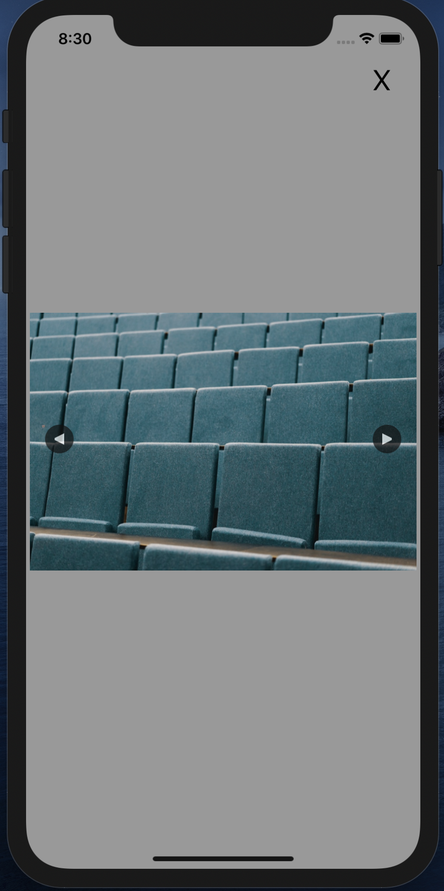

# loki-unsplash-react-native
> React Native simple app for LOKI.

Its simple app for fetching users from unsplash api and show them to user. when user click on user should be able to see the list of users 





## Installation

windows/linux:
```sh
npm install i
cd ios/
pod install
cd ..
npm run ios
```

# Improvements

- Fetch Users photos seperatly to get all photos ``/users/:username/photos``
- fix bug with GestureRecognizer in modal
- show grids better
